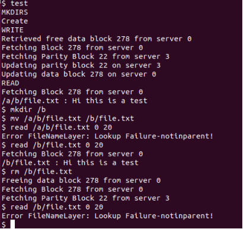
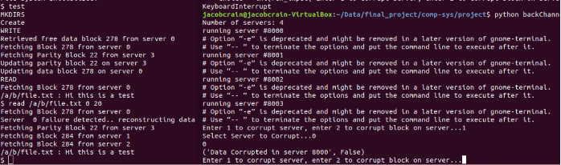
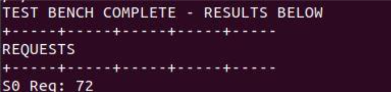
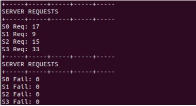
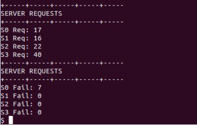

# Parallel NFS with RAID 5 Redundancy

## Summary

This repository contains files relating to the final project in the course [Principles of Computer System Design](https://www.ece.ufl.edu/wp-content/uploads/syllabi/Fall2019/EEL4736_Prin_Comp_Sys_Figueiredo_Fall_2019.pdf). During the first 2 months of the course, each student implemented a Python model of several core features in a UNIX-style filesystem on top of provided basic IO control files. Some features we implemented include an inode layer for storing and retrieving data in data blocks,  an absolute path name layer for resolving filenames, and a filesystem interface that uses lower-level layers to implement common UNIX commands like mkdir, write, read, rm, and mv. Additionally, we implemented a client interface to the filesystem to model a client/server architecture. 

During the last 2 weeks of the class, my team of two students had the following goals for our final project:
- Upgrade the client/server architecture to work with a cluster of 4 servers using **virtual memory**.
- Modify the client stub for **load distribution** across all servers, to minimize response time and avoid overloading of a single component.
- Implement **RAID 5 redundancy** so that corruption of data due to a single server failure could be fully recovered.
- Add a 16-byte **checksum** to the end of a data block, so that the server can check for data decay before returning data to the client.
- Add a back channel that allows users to "destroy" a server or incorrectly modify a piece of stored memory to model data decay. The back channel allows for testing the RAID 5 and checksum features added for the project.

## Project Testing

To test the filesystem, my team used a Linux virtual machine to run the filesystem model. For setup, we launch the _Filesystem_ script in one terminal as the client-side interface and launch the _backChannel_ script in another terminal. The _backChannel_ script launches the 4 servers and the client automatically connects.

**Basic Filesystem Usage**

Figure 1 below shows basic filesystem usage in the client-side terminal with commands like mkdir, write, read, mv, rm.  Write and read commands show the block numbers of the data/parity blocks and the server number that the data block is stored on.  This is useful for showing load distribution across all servers.

**NOTE:** In the screenshot, we also use a custom command called 'test' that allows us to quickly set up some directories and files for testing. The 'test' command sets up a couple directories and creates the file located at '/a/b/file.txt.' Additionally,  the 'test' command writes the message 'Hi this is a test' to the file and reads the message back. Starting at the line 'mkdir /b', we show normal filesystem usage by typing in commands to the terminal manually.

***Figure 1:** Snapshot of Filesystem terminal performing basic filesystem commands like mkdir, write, read, mv, rm.*

Notice how the filesystem cannot find the file two times throughout the test. This is expected behavior since the previous lines for both error cases either move or remove the file from the location that the user requested to read from. 

**Data Recovery with RAID 5**

To test the RAID 5 recovery with parity blocks, we compared the read data to the data we reconstructed on a server failure. The data matched, showing that our reconstruction methods work correctly.  Figure 2 shows an example of one of these tests. 

***Figure 2:** Snapshot of the Filesystem reconstructing corrupted data after 1 of 4 servers failed.*

The client-side terminal is on the left side of Figure 2 and the backChannel is on the right terminal so that we could control server failure. For this test, we corrupted server 0 and tried to read back the message in file.txt that was stored on server 0. As expected, the client recognizes the server failure and makes requests the the 3 data blocks required to reconstruct the message (in this case, it was a parity block on server 3 and two data blocks on servers 1 and 2). The message was correctly reconstructed by XORing all 3 requested blocks. The message printed out on the terminal saying 'Hi this is a test.'    

**Performance Results**

With the additional protection of RAID 5, we expected some amount of performance cost due to requests to 4 separate servers and the additional parity block calculations on each update. To determine the performance cost, we ran the same test script on our original filesystem from before our final project AND on our final project filesystem. The results are shown in the screenshots below.

***Figure 3:** Original filesystem performance resulting in 72 requests.*

***Figure 4:** RAID5 filesystem without failure resulting in 74 requests.*

***Figure 5:** RAID5 filesystem with a server failure resulting in 95 requests.*

## Documentation

An in-depth report of our final result and the final project prompt can be found in the docs folder or by clicking on the links below.

- [Prompt](https://github.com/digitaldanny/ParallelNFS/blob/master/docs/Prompt.pdf)
- [Report](https://github.com/digitaldanny/ParallelNFS/blob/master/docs/Project%20Report.pdf)

## Contributors

- Daniel Hamilton [**(@sweatpantsdanny)**](https://github.com/sweatpantsdanny)
- Jacob Crain [**(@Jake16000)**](https://github.com/Jake16000)
